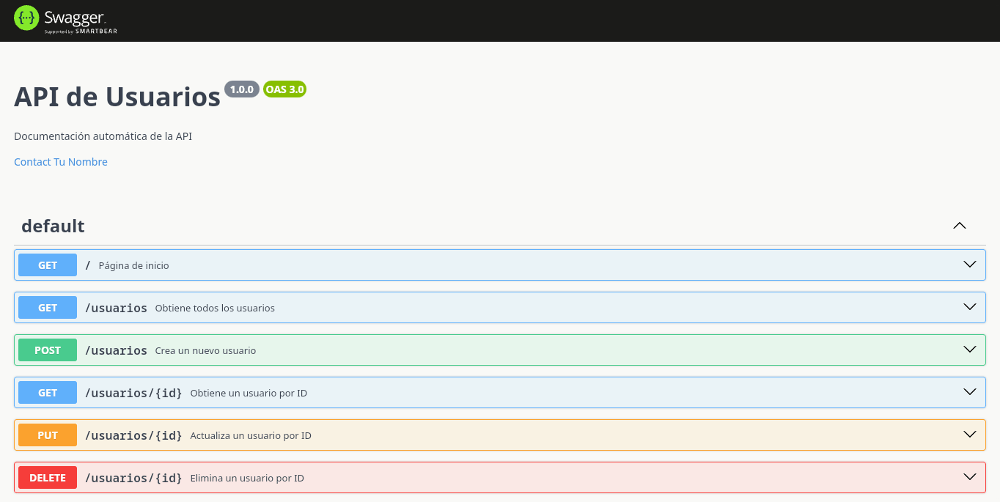
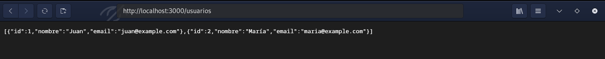
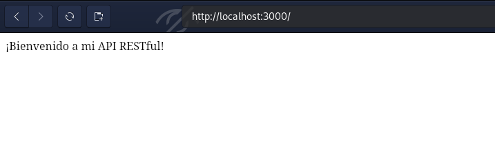

# Node-CRUD-swagger-Example

Este proyecto es un servicio RESTful básico para la gestión de usuarios, desarrollado con Node.js y documentado automáticamente con Swagger utilizando `express-jsdoc-swagger`.

## Características

- CRUD básico para el recurso "usuarios".
- Documentación automática de la API con Swagger.
- Uso de middlewares como `cors` y `body-parser`.

## Instalación

1. Clona el repositorio:
    ```bash
    git clone <URL_DEL_REPOSITORIO>
    ```
2. Navega al directorio del proyecto:
    ```bash
    cd Node-CRUD-swagger-Example
    ```
3. Instala las dependencias:
    ```bash
    npm install
    ```

## Uso

1. Inicia el servidor:
    ```bash
    node server.js
    ```
2. Accede a la documentación de la API en tu navegador:
    ```
    http://localhost:3000/api-docs
    ```

## Endpoints

- `GET /usuarios`: Obtiene todos los usuarios.
- `GET /usuarios/:id`: Obtiene un usuario por ID.
- `POST /usuarios`: Crea un nuevo usuario.
- `PUT /usuarios/:id`: Actualiza un usuario por ID.
- `DELETE /usuarios/:id`: Elimina un usuario por ID.

## Capturas de Pantalla

### Documentación de la API



### Lista de Usuarios



### Detalle de Usuario



## Contribuciones

Las contribuciones son bienvenidas. Por favor, abre un issue o un pull request para discutir cualquier cambio que desees realizar.

## Licencia

Este proyecto está licenciado bajo la Licencia MIT.
